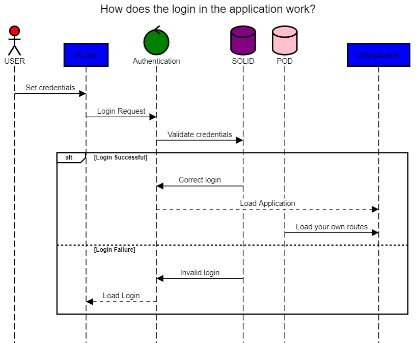

<<<<<<< HEAD
[[section-runtime-view]]
== Runtime View

[role="arc42help"]
****
.Contents
The runtime view describes concrete behavior and interactions of the system’s building blocks in form of scenarios from the following areas:

* important use cases or features: how do building blocks execute them?
* interactions at critical external interfaces: how do building blocks cooperate with users and neighboring systems?
* operation and administration: launch, start-up, stop
* error and exception scenarios

Remark: The main criterion for the choice of possible scenarios (sequences, workflows) is their *architectural relevance*. It is *not* important to describe a large number of scenarios. You should rather document a representative selection.

.Motivation
You should understand how (instances of) building blocks of your system perform their job and communicate at runtime.
You will mainly capture scenarios in your documentation to communicate your architecture to stakeholders that are less willing or able to read and understand the static models (building block view, deployment view).

.Form
There are many notations for describing scenarios, e.g.

* numbered list of steps (in natural language)
* activity diagrams or flow charts
* sequence diagrams
* BPMN or EPCs (event process chains)
* state machines
* ...

****

=== <Runtime Scenario 1>

* _<insert runtime diagram or textual description of the scenario>_
* _<insert description of the notable aspects of the interactions between the
building block instances depicted in this diagram.>_

It is possible to use a sequence diagram:

[plantuml,"Sequence diagram",png]
----
Alice -> Bob: Authentication Request
Bob --> Alice: Authentication Response

Alice -> Bob: Another authentication Request
Alice <-- Bob: another authentication Response
----
=== <Runtime Scenario 2>

=== ...

=== <Runtime Scenario n>
=======
[[section-runtime-view]]
== Runtime View
This is not a definitive version. We will be adding more scenarios later

=== How does the application login work?

* Shows the login of the application and how the whole process works. 
* A user enters their credentials in the login interface. Then, that interface sends the request to the authenticator, which in turn validates the data on the SOLID server. From here, two situations can occur:
	** The first is that the session is correct and then loads the new graphical interface (that of the application) and then loads its own routes from its own POD.
	** The second option is that the login is invalid, which causes the graphical interface of the login to be loaded again with an error message.
* Notably,the SOLID server is different from the user's POD.

This is the sequence to generate the uml:

[plantuml,"Sequence diagram",png]
----
title How does the login in the application work?

actor USER #red
participant UILogin #blue
control Authentication #green
database SOLID #purple
database POD #pink
participant UIApplication #blue

USER -> UILogin: Set credentials
UILogin -> Authentication: Login Request
Authentication -> SOLID: Validate credentials

alt Login Successful
	SOLID -> Authentication: Correct login
	Authentication --> UIApplication: Load Application
    POD->UIApplication: Load your own routes

else Login Failure
	SOLID -> Authentication: Invalid login
	Authentication --> UILogin: Load Login
	end

----
=== Add route

* Show how a route is added to the application.
* The user wants to add a route. In the application there will be a button or something similar in which you can add a route. When everything requested to save the route has been added, there will be a service that validates that the route is correct. This service will try to save the route in your POD. From here, two situations can occur:
** That the route is saved successfully and you receive a message that it was saved correctly.
** Or that the route could not be saved and you receive an error message.

This is the sequence to generate the uml:

[plantuml,"Sequence diagram",png]
----
title How do you add a route?

actor USER #red
participant UIApplication #blue
control AddRouteService #green
database POD #pink

USER -> UIApplication: ADD ROUTE
UIApplication -> AddRouteService: AddRouteInYourPOD()
AddRouteService -> POD: Save route in your POD

alt correct
	POD -> AddRouteService: Route saved
	AddRouteService --> UIApplication: Successful message

else incorrect
	POD -> AddRouteService: Route could't be saved
	AddRouteService --> UIApplication: Failure message
	end
----

=== <Runtime Scenario n>
>>>>>>> dac078e83f06d9c603ee5e4406af797426c5cdb9
